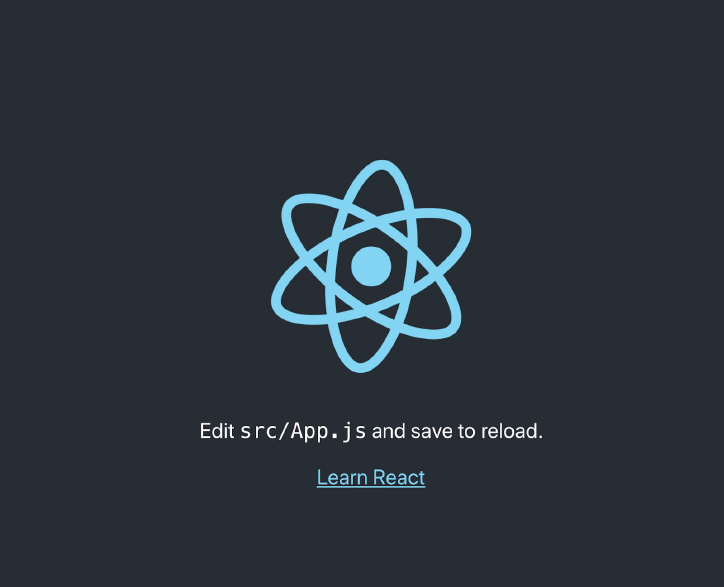
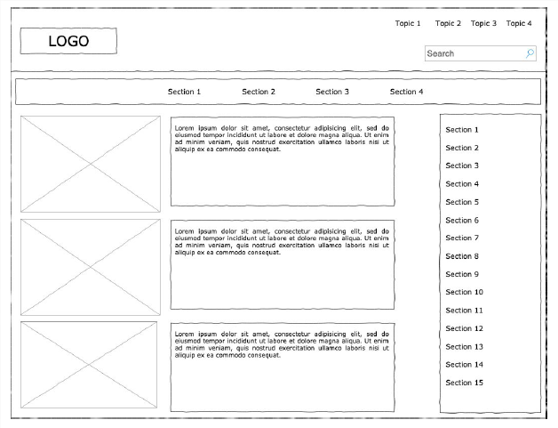
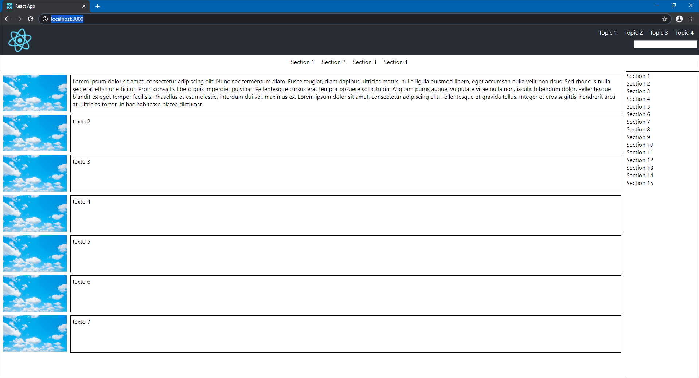

# Exercício 1
## Passo 1
Utilizando a linha de comando, rode o comando npx create-react-app exercicio-01 pelo terminal

## Passo 2
Para certificar que o comando foi executado com sucesso, entre na pasta criada utilizando o comando
cd exercicio-01 e em seguida rode o comando npm start . A aplicação deverá rodar na url localhost:3000
e você deverá visualizar esta tela:

## Passo 3
Após certificar de que os comandos foram executados com sucesso, você deverá desenvolver um
rascunho da aplicação conforme descrita abaixo, utilizando pelo menos 5 componentes:
* Cabeçalho;
* Menu de navegação;
* Artigo;
* Sidebar.

# Resultado

# Para executar

`npm start`
Runs the app in the development mode. 
Open [http://localhost:3000](http://localhost:3000) to view it in the browser.

## Autor
Diogo Passos Perdigão Britto